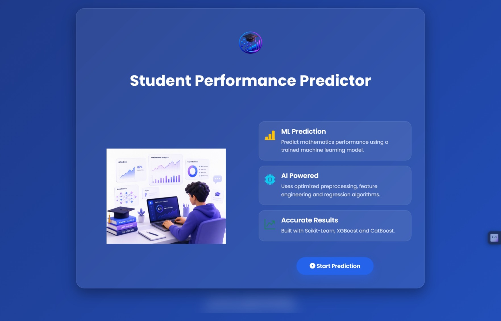
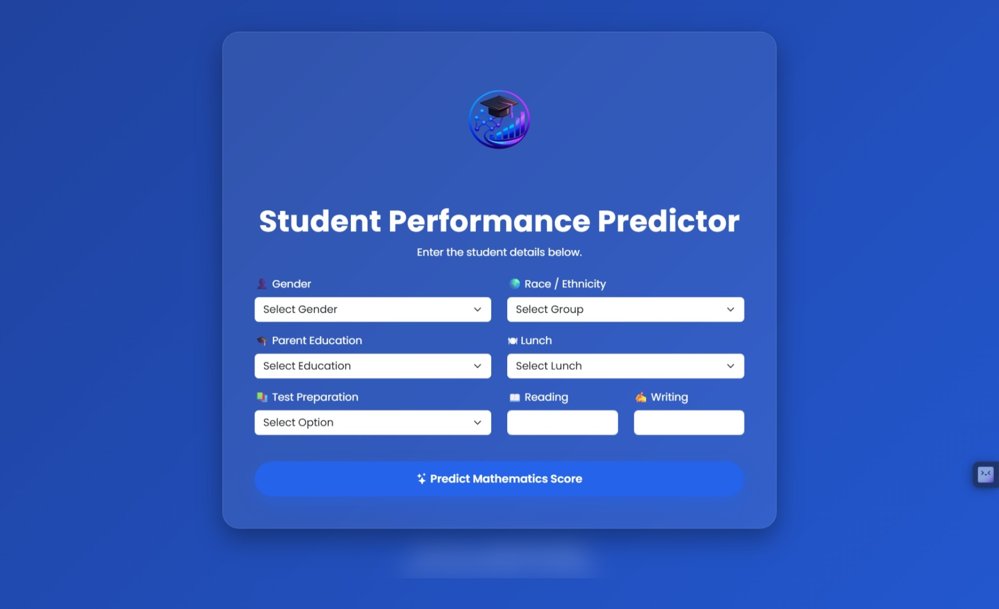
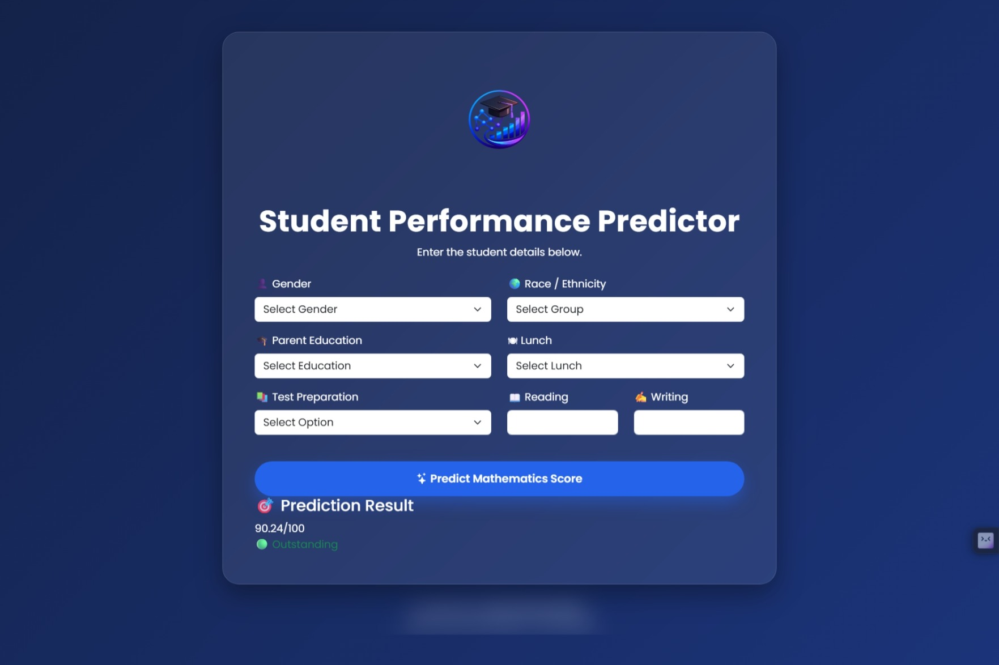

# 🎓 Student Performance Predictor

A complete End-to-End Machine Learning project built with **Python, Scikit-Learn, Flask, and Bootstrap** that predicts a student's **Mathematics Score** based on demographic and academic information.

This project demonstrates the complete machine learning lifecycle, from data preprocessing and model training to web application deployment.

---

## 🚀 Live Demo

> **Coming Soon** (Deploy on Render / Railway)

---

## 📸 Application Preview

### Landing Page

Modern landing page introducing the Student Performance Prediction System.



---

### Prediction Page

Users enter student information to predict the Mathematics score.



---

### Prediction Result

The application displays the predicted Mathematics score generated by the trained machine learning model.



---

# 📌 Features

- ✅ End-to-End Machine Learning Pipeline
- ✅ Data Ingestion
- ✅ Data Transformation
- ✅ Feature Engineering
- ✅ Model Training
- ✅ Hyperparameter Tuning
- ✅ Automatic Best Model Selection
- ✅ Model Serialization
- ✅ Prediction Pipeline
- ✅ Professional Flask Web Application
- ✅ Responsive Bootstrap UI
- ✅ Logging & Exception Handling
- ✅ Modular Project Structure

---

# 🛠 Tech Stack

## Programming Language

- Python 3.x

## Machine Learning

- Scikit-Learn
- XGBoost
- CatBoost
- Pandas
- NumPy

## Backend

- Flask

## Frontend

- HTML5
- CSS3
- Bootstrap 5
- JavaScript

## Model Serialization

- Pickle

---

# 📂 Project Structure

```text
ML_Projects/
│
├── artifacts/
│   ├── model.pkl
│   ├── preprocessor.pkl
│   ├── raw.csv
│   ├── train.csv
│   └── test.csv
│
├── logs/
│
├── notebook/
│
├── src/
│   ├── components/
│   │   ├── data_ingestion.py
│   │   ├── data_transformation.py
│   │   └── model_trainer.py
│   │
│   ├── pipeline/
│   │   ├── train_pipeline.py
│   │   └── predict_pipeline.py
│   │
│   ├── logger.py
│   ├── exception.py
│   └── utils.py
│
├── static/
│   ├── css/
│   ├── js/
│   └── images/
│
├── templates/
│   ├── index.html
│   └── home.html
│
├── app.py
├── requirements.txt
├── setup.py
├── README.md
└── .gitignore
```

---

# 📊 Dataset

The project uses the **Student Performance Dataset**.

### Features

- Gender
- Race / Ethnicity
- Parental Level of Education
- Lunch
- Test Preparation Course
- Reading Score
- Writing Score

### Target

- Mathematics Score

---

# ⚙ Machine Learning Workflow

```text
Dataset

↓

Data Ingestion

↓

Data Transformation

↓

Feature Engineering

↓

Model Training

↓

Hyperparameter Tuning

↓

Best Model Selection

↓

Model Serialization

↓

Flask Application

↓

Prediction
```

---

# 🤖 Models Trained

- Linear Regression
- Ridge Regression
- Lasso Regression
- ElasticNet
- Decision Tree Regressor
- Random Forest Regressor
- Extra Trees Regressor
- Gradient Boosting Regressor
- AdaBoost Regressor
- K-Nearest Neighbors
- XGBoost Regressor
- CatBoost Regressor

The project automatically evaluates all models and selects the best-performing model based on the **R² Score**.

---

# 📈 Evaluation Metric

The primary evaluation metric used is:

- **R² Score (Coefficient of Determination)**

Example:

| Model | Test R² |
|---------|---------:|
| ElasticNet | **0.8808** |
| Linear Regression | 0.8804 |
| Ridge Regression | 0.8804 |
| Gradient Boosting | 0.8722 |
| CatBoost | 0.8702 |

---

# 🖥 Installation

Clone the repository

```bash
git clone https://github.com/Aryan-1105/Student-Performance-Predictor.git
```

Move into the project directory

```bash
cd Student-Performance-Predictor
```

Create a virtual environment

```bash
python -m venv venv
```

Activate it

### Windows

```bash
venv\Scripts\activate
```

### Linux / macOS

```bash
source venv/bin/activate
```

Install dependencies

```bash
pip install -r requirements.txt
```

---

# ▶ Running the Project

Train the model

```bash
python src/pipeline/train_pipeline.py
```

Run the Flask application

```bash
python app.py
```

Open your browser

```text
http://127.0.0.1:5000
```

---

# 📷 Application Workflow

```text
User

↓

Flask Application

↓

Prediction Pipeline

↓

Preprocessor

↓

Machine Learning Model

↓

Predicted Mathematics Score
```

---

# 📌 Future Improvements

- Docker Support
- CI/CD with GitHub Actions
- Cloud Deployment (Render/Railway)
- Model Monitoring
- Explainable AI (SHAP)
- User Authentication
- Database Integration
- REST API

---

# 👨‍💻 Author

**Aryan Kumar Sahoo**

Mechanical Engineering

National Institute of Technology Rourkela

GitHub:
https://github.com/Aryan-1105

LinkedIn:
https://linkedin.com/in/aryan-kumar-sahoo

---

# ⭐ Support

If you found this project helpful, please consider giving it a ⭐ on GitHub.

---

# 📜 License

This project is licensed under the MIT License.
